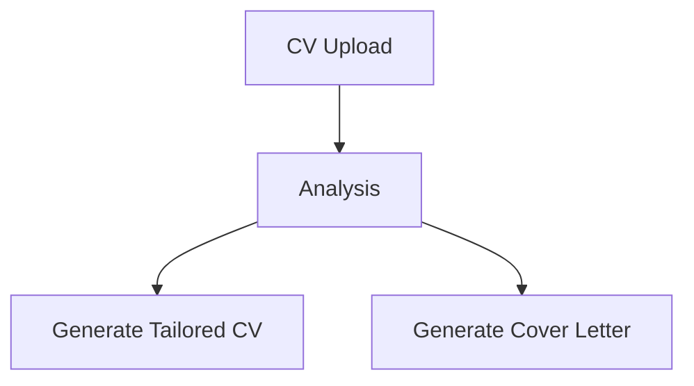

<link rel="stylesheet" href="style.css">
# My first site
Hello Github Pages ! I want to test all functions here.

```mermaid
graph TD
  A[CV Upload] --> B[Analysis]
  B --> C[Generate Tailored CV]
  B --> D[Generate Cover Letter]
```

[About](about.md) | [Contact](contact.md)
